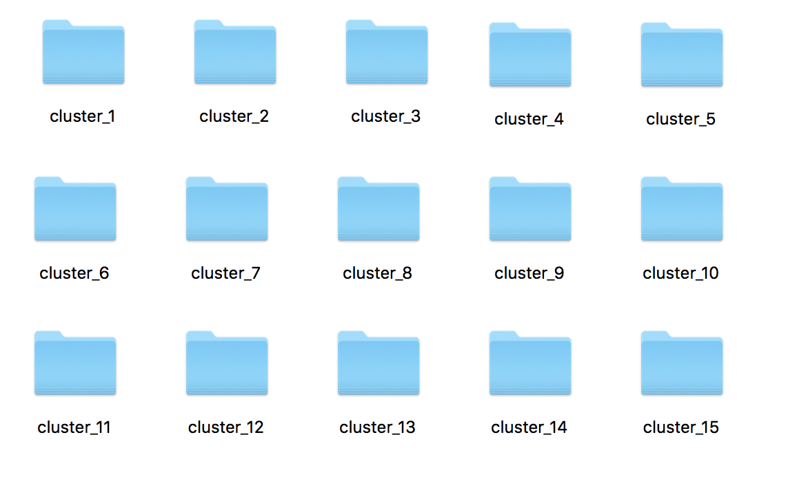

Output
==================

The details of the output files are as follows!

*Please note, _c next to a gene simply means gene compliment*

Each cluster gives its own output folder:

Within each folder we have a variety of outputs for the given cluster:

.. image:: Outs.png

Combined_plot

   Top performing gene in the cluster binary & continuous plots vs the top 15
   other genes in the cluster.

Discrete_plots

   Gene combination plots ranked , binary data only

Singleton_combined_plot

   Single gene binary vs continuous plots

TP_TN plots

   single gene (singleton) & combination gene True Positive vs True Negative for
   top ranked genes 

